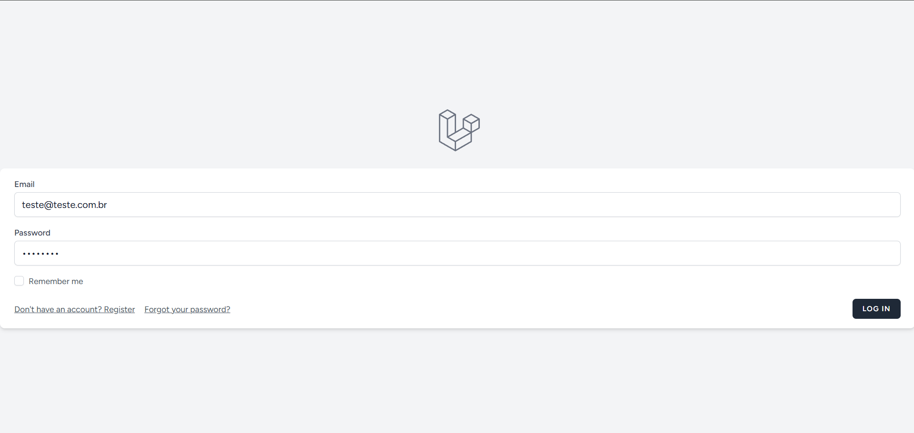
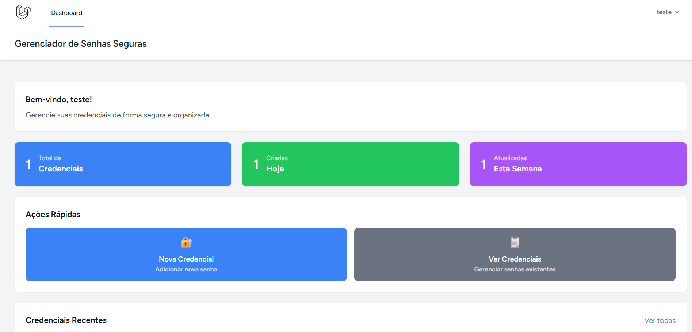
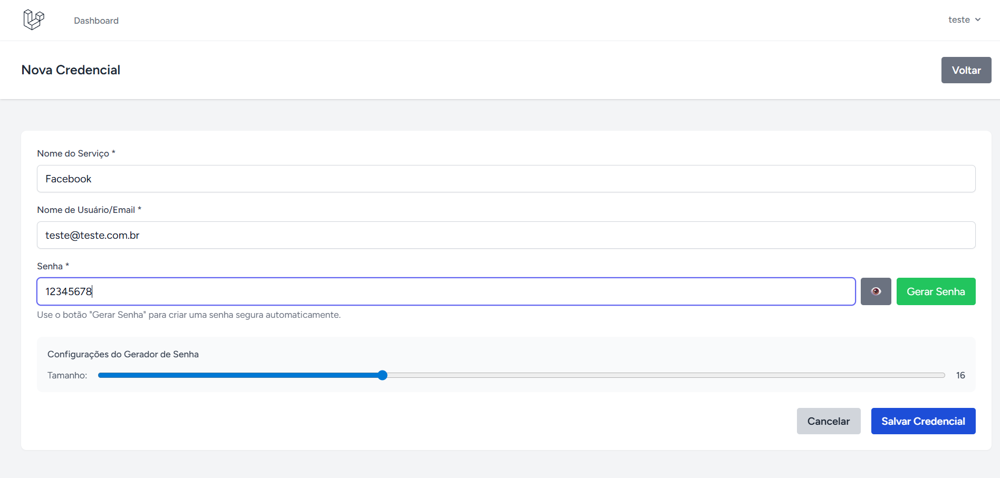

# Password Manager - Gerenciador de Senhas

Sistema web seguro para gerenciamento de credenciais desenvolvido em Laravel com autenticação, criptografia e gerador de senhas.

## Demonstração Online

  Acesso teste:
  - Login: teste@teste.com.br
  - Senha: 12345678
    obs: Pode criar qualquer acesso fictício :)
**[Acesse a aplicação em produção](https://passwordmanager-t0lw.onrender.com)**

*Aplicação hospedada no Render para demonstração* (Leve instabilidade)

## 📱 Screenshots

### Tela de Login


### Dashboard Principal


### Criar Nova Credencial


## Funcionalidades

- Sistema de autenticação completo (login/registro)
- Gerenciamento seguro de credenciais
- Gerador de senhas seguras com configurações personalizáveis
- Criptografia de senhas no banco de dados
- Interface moderna e responsiva com Tailwind CSS
- Validação de formulários
- Proteção CSRF

## Tecnologias Utilizadas

- **Backend:** Laravel 10.x
- **Frontend:** Blade Templates, Tailwind CSS, Vite
- **Banco de Dados:** MySQL
- **Autenticação:** Laravel Breeze
- **Criptografia:** Laravel Encryption

## Pré-requisitos

Antes de executar o projeto, certifique-se de ter instalado:

- PHP >= 8.1
- Composer
- Node.js >= 16.x
- NPM
- MySQL >= 5.7
- Git

## Instalação e Configuração

### 1. Clone o repositório
```bash
git clone <url-do-repositorio>
cd PasswordManager
```

### 2. Instale as dependências do PHP
```bash
composer install
```

### 3. Instale as dependências do Node.js
```bash
npm install
```

### 4. Configure o ambiente
```bash
# Copie o arquivo de exemplo
cp .env.example .env

# Gere a chave da aplicação
php artisan key:generate
```

### 5. Configure o banco de dados
Edite o arquivo `.env` com suas configurações de banco:

```env
DB_CONNECTION=mysql
DB_HOST=127.0.0.1
DB_PORT=3306
DB_DATABASE=password_manager
DB_USERNAME=seu_usuario
DB_PASSWORD=sua_senha
```

### 6. Crie o banco de dados
```sql
CREATE DATABASE password_manager;
```

### 7. Execute as migrações
```bash
php artisan migrate
```

### 8. Compile os assets
```bash
# Para desenvolvimento (necessário manter rodando)
npm run dev

# Para produção
npm run build
```

### 9. Inicie o servidor
```bash
php artisan serve
```

O projeto estará disponível em: `http://127.0.0.1:8000`

## Como Usar

### 1. Registro/Login
- Acesse a aplicação e crie uma conta ou faça login
- Todos os dados são protegidos por autenticação

### 2. Gerenciar Credenciais
- **Criar:** Clique em "Nova Credencial" no dashboard
- **Visualizar:** Veja todas suas credenciais na lista principal
- **Editar:** Clique no ícone de edição para modificar
- **Excluir:** Use o botão de exclusão (com confirmação)

### 3. Gerador de Senhas
- Na criação/edição de credenciais, use o botão "Gerar Senha"
- Ajuste o tamanho da senha (8-32 caracteres)
- A senha gerada inclui letras, números e símbolos especiais

## Segurança

- **Criptografia:** Todas as senhas são criptografadas antes de serem salvas
- **Autenticação:** Sistema completo com proteção de rotas
- **CSRF Protection:** Proteção contra ataques CSRF
- **Validação:** Validação rigorosa de todos os inputs
- **Hash de Senhas:** Senhas de usuário com hash bcrypt

## Estrutura do Projeto

PasswordManager/
├── app/
│   ├── Http/Controllers/
│   │   └── CredencialController.php    # Controlador principal
│   └── Models/
│       └── Credencial.php              # Model das credenciais
├── database/
│   └── migrations/
│       └── create_credenciais_table.php # Estrutura do banco
├── resources/
│   └── views/
│       ├── credenciais/                # Views das credenciais
│       └── layouts/                    # Layouts da aplicação
└── routes/
└── web.php                         # Rotas da aplicação


## Testando a Aplicação

### Funcionalidades para Testar:

1. **Autenticação**
   - Registro de novo usuário
   - Login/Logout
   - Proteção de rotas

2. **CRUD de Credenciais**
   - Criar nova credencial
   - Listar credenciais
   - Editar credencial existente
   - Excluir credencial

3. **Gerador de Senhas**
   - Gerar senha com diferentes tamanhos
   - Verificar complexidade da senha gerada
   - Aplicar senha gerada no formulário

4. **Segurança**
   - Tentar acessar rotas protegidas sem login
   - Verificar criptografia das senhas no banco
   - Testar proteção CSRF

## Solução de Problemas

### Erro "could not find driver"
```bash
# Limpe o cache
php artisan config:clear
php artisan cache:clear

# Verifique se as extensões MySQL estão habilitadas no PHP
```

### Assets não carregam
```bash
# Compile os assets novamente
npm run dev
# ou
npm run build
```

### Problemas de permissão
```bash
# No Linux/Mac
sudo chmod -R 775 storage bootstrap/cache

# No Windows, execute como administrador
```

## Importante para Execução Local

**Para que a aplicação funcione completamente, é necessário:**

1. **Manter o servidor Laravel rodando:**
   ```bash
   php artisan serve
   ```

2. **Manter o Vite rodando (para desenvolvimento):**
   ```bash
   npm run dev
   ```

3. **Ou compilar os assets para produção:**
   ```bash
   npm run build
   ```

**Sem o Vite rodando ou assets compilados, o CSS e JavaScript não funcionarão corretamente.**

## Acesso para Demonstração

**[Teste a aplicação online](https://passwordmanager-t0lw.onrender.com)**
